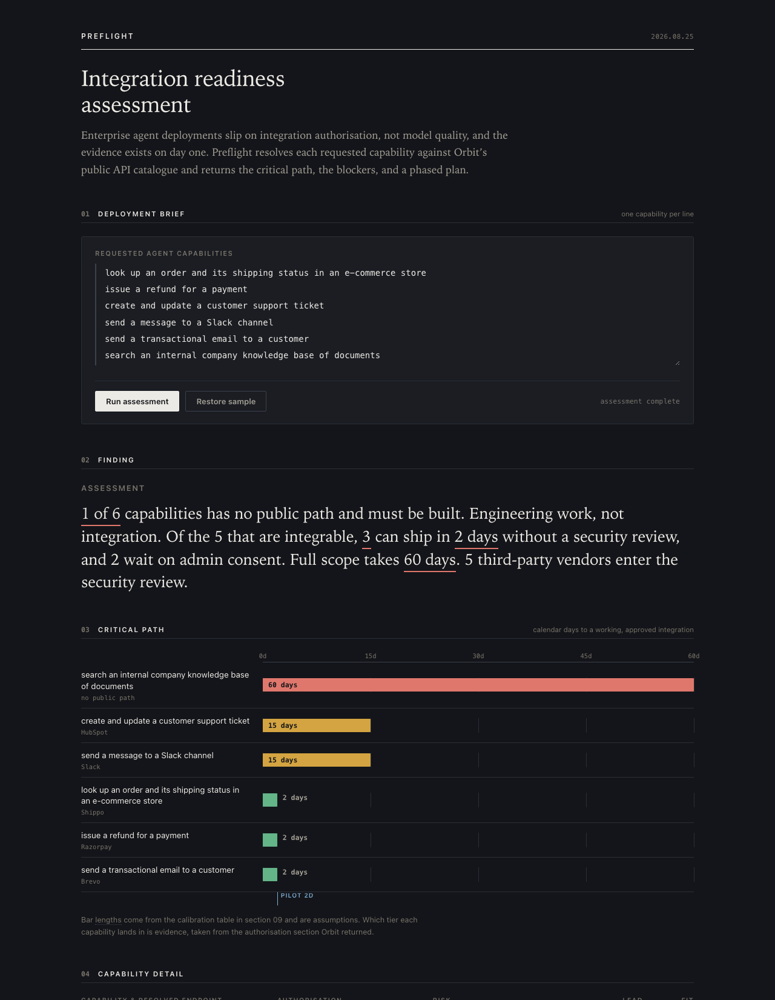
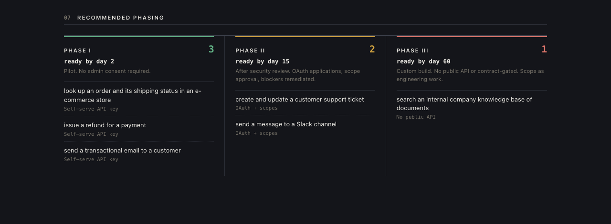

# Preflight

Integration readiness assessment for enterprise agent deployments, built on
[Orbit by Postman](https://www.buildwithorbit.ai/welcome).

[](https://github.com/Delta00204/preflight/actions/workflows/verify.yml)

Describe what an agent needs to do, in plain English. Preflight resolves each
capability against Orbit's public API catalogue and returns what already exists,
what has no public path, what each surviving capability costs in authorisation,
and a phased plan you can put in a statement of work.

Written up as a case study in [`CASE-STUDY.html`](CASE-STUDY.html), including the
five occasions during the build where evidence contradicted the design.

## Run it

```bash
node server.mjs
```

Then open <http://127.0.0.1:7878>. Node 18 or newer. No dependencies, no build
step, no API key. Orbit itself requires no authentication.

```bash
node validate.mjs     # 108 assertions, runs offline
node scan-secrets.mjs # credential scan over the committed cache
node coverage.mjs     # catalogue coverage study, 32 capabilities across 8 domains
```

## What it produces

For the sample support-agent brief:

| | |
|---|---|
| 1 of 6 capabilities | no public path, so engineering work rather than integration |
| 3 of 6 | callable within 2 days, no security review required |
| 60 days | full scope, driven by the single custom-build capability |
| 6 findings | catalogue defects across 40 candidate endpoints inspected |

Plus a critical path chart, a phased plan, a catalogue security scan, and
Anthropic tool-use schemas for every capability that cleared.



The plan is phased by what gates each capability, so the work that needs no
security review is separated from the work that does.



## The problem

A forward-deployed engineer leaves a discovery workshop with a capability list
and one question standing between them and a commitment: how much of this already
exists, and how much are we building from nothing? Every downstream number depends
on that split, and it is usually discovered in week three rather than week one.

For the half that does exist, the cost is rarely writing the call. It is getting
permission to make it: an OAuth application, customer admin consent, a security
review, a data processing agreement.

Both halves were computable on day one. Orbit's `integrate` endpoint returns a
real `AUTH` section, and its silences are themselves informative.

## How it works

For each capability in the brief:

1. `POST /v1/search` resolves the plain-English capability to candidate endpoints.
2. Candidates are ranked, de-prioritising blocking defects and unresolved tenant hosts.
3. `POST /v1/integrate` returns the authorisation model, base URL, call steps and gotchas.
4. Orbit states its own `FIT` verdict. On `Not at all`, Preflight walks to the next
   candidate, and if all are rejected it follows Orbit's own re-search hint before
   giving up.
5. The result is scored into an authorisation tier, a lead time, and a phase.

### Authorisation tiers

| Tier | Meaning |
|---|---|
| `NONE` | Callable with no credentials. Returned only on explicit Orbit evidence. |
| `API_KEY` | Self-serve signup and key. |
| `OAUTH` | Application registration plus customer admin consent. |
| `ENTERPRISE` | Contract, procurement or partner approval. |
| `CUSTOM` | No public path. Scope as engineering work. |

The classifier is asymmetric by design. `NONE` requires an affirmative statement
that no authentication is *required*; the absence of an `AUTH` section floors at
`API_KEY` and raises `AUTH_UNVERIFIED`. Under-estimating authorisation burden is
the failure this tool exists to prevent, so optimism is the one direction it must
never fail in.

### Risk flags

| Flag | Blocking | Raised when |
|---|---|---|
| `NO_COVERAGE` | yes | No candidates for any phrasing tried. |
| `INTERNAL_MISMATCH` | yes | The capability names an internal system but resolved to a public vendor. |
| `CATALOG_GAP` | yes | Orbit rejected every candidate, including after its own re-search hint. |
| `SANDBOX_URL` | yes | The catalogued host is a test environment. |
| `MALFORMED_URL` | yes | The published entry has a broken URL. |
| `LEAKED_CREDENTIAL` | yes | A literal secret appears in the catalogued URL. |
| `VENDOR_UNREVIEWED` | no | Vendor absent from the approved list in `config.json`. |
| `UNRESOLVED_HOST` | no | Base URL is a tenant-specific template. |
| `WRITE_ACTION` | no | The endpoint mutates state or moves money. |
| `WEAK_FIT` | no | Orbit rated it a partial fit. |
| `AUTH_UNVERIFIED` | no | Orbit documented no authorisation scheme. |

Hygiene scanning covers every candidate returned, not only the selected one, on
the basis that an engineer reading the same results by hand would copy a sandbox
URL just as readily.

## What is measured and what is assumed

This distinction is load-bearing, and the report states it rather than burying it.

**Measured.** Every endpoint, authorisation model, base URL, call step, gotcha,
`FIT` verdict and coverage gap. Reproduced from Orbit unaltered. All risk flags
derive deterministically from real URLs and methods. There are no mocks or
fixtures anywhere: a single `fetch` in the codebase, pointing at Orbit.

**Assumed.** The mapping from authorisation tier to calendar days, and the
approved-vendor list. Both live in [`config.json`](config.json). They are the only
invented numbers in the report. Replace them with your own delivery history before
quoting a date to a customer.

Every conclusion carries a decision trace whose steps are typed `evidence`,
`inference` or `assumption` with their source, and an assertion guarantees exactly
one assumption per capability. An engineer asked "why fifteen days?" in front of a
customer can answer from the artefact.

## Verification

```bash
node validate.mjs
```

108 assertions across five deployment briefs, plus browser-bundle and layout
checks. Among the invariants:

- `NONE` appears only on explicit Orbit evidence, and undocumented authorisation
  is never read as no-authorisation
- zero coverage implies custom-build scoping; catalogue gaps do not
- the pilot phase excludes OAuth, unreviewed vendors and weak matches
- no generated tool schema exposes a secret parameter, on any code path
- no unredacted secret survives into output
- malformed and oversized requests are rejected rather than fatal
- identical inputs produce identical reports

Every validation run during development surfaced a real defect, including a
`routing_key` leaking into a generated tool schema and a browser bundle that
parsed as a dead page while all server assertions passed. See
[`DECISIONS.md`](DECISIONS.md).

### Why the cache is in git

`.cache/` holds 141 real Orbit API responses, keyed by request hash. Committing
them makes the suite deterministic and fully offline: the five briefs make 50
Orbit calls and take 50 cache hits, so CI cannot fail on a rate limit and a fresh
clone produces results immediately rather than after roughly seventy seconds of
cold requests. They are also evidence that the calls were real.

Orbit's catalogue is user-published content and does sometimes contain live
keys: a Positionstack credential was observed in a search result during
development. `scan-secrets.mjs` therefore runs in CI over every committed file
and fails the build on a literal credential, rather than relying on a manual
check at publication time. Treat any example URL from the catalogue as untrusted
input.

## Repository layout

```
server.mjs          local server, NDJSON progress streaming, request validation
validate.mjs        verification suite
coverage.mjs        catalogue coverage study
scan-secrets.mjs    credential guard for the committed cache, runs in CI
phrasing.mjs        the phrasing-stability experiment behind INTERNAL_MISMATCH
config.json         calibration, the only assumed numbers
lib/orbit.mjs       Orbit client with disk cache, 429 backoff and telemetry
lib/score.mjs       authorisation tiering, risk flags, phasing, decision traces
lib/toolgen.mjs     Anthropic tool-use schema emitter
lib/paraphrase.mjs  phrasing ensemble for coverage-gap probing
briefs/             five sample deployment briefs
public/index.html   the report
CASE-STUDY.html     write-up of the build
```

## Limitations

Precision tracks catalogue quality. Where Orbit's coverage is thin it returns a
plausible-looking wrong endpoint rather than nothing. "Query application error
metrics" resolved to Meta with a full fit score and no flags. The guards make most
of these visible; they do not catch all of them.

Preflight sees the public catalogue, not the customer's own tenant. It cannot know
their Zendesk instance, their SSO configuration or their data residency posture.
Vendor pinning, where the engineer supplies the known stack, is the first item on
the roadmap in [`DECISIONS.md`](DECISIONS.md).

This is a scoping instrument rather than an autopilot. It exists to make a
human's day-one conversation with a customer sharper and better evidenced.

## Deployment

The server binds to `127.0.0.1` and is intended to run locally. It is not
serverless-ready as written: it is a long-running process, the cache depends on a
writable filesystem, a cold scan can exceed sixty seconds, and there is no
authentication in front of `/api/scan`. Hosting it publicly without addressing
those would expose an unauthenticated endpoint that consumes Orbit's rate limit.

## Build

Built with [Claude Code](https://claude.com/claude-code) (Opus 5). The
verification suite, the decision traces and the record in `DECISIONS.md` exist so
that the reasoning is auditable rather than taken on trust.

## Licence

MIT. See [`LICENSE`](LICENSE).
